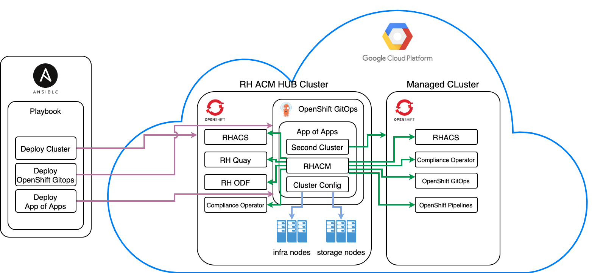

# Overview

This repository contains example of automation code that helps to deploy OpenShift 4.11 as a [Red Hat Advanced Cluster Manager](https://www.redhat.com/en/technologies/management/advanced-cluster-management) hub cluster on GCP and perform after install configuration tasks. Initial installation of OpenShift cluster is performed by ansible. As soon as cluster installation is finished, ansible installs [OpenShift GitOps](https://docs.openshift.com/container-platform/4.11/cicd/gitops/understanding-openshift-gitops.html) and [App of Apps](https://argo-cd.readthedocs.io/en/stable/operator-manual/cluster-bootstrapping/#app-of-apps-pattern) root app for it. **App of Apps** (root app) deploys other supporting applications that include:
- **Cluster Config** app - this application is based on helm chart for more robust templating options and does initial configuration of the cluster: adds infra and storage nodes by generating machineset manifests with help of [OpenShift Gitops Custom Tooling](https://argo-cd.readthedocs.io/en/stable/operator-manual/custom_tools/) to pull cluster id and machineset details from the cluster. It also has example of configuration to migrate **Monitoring** stack to infra nodes.
- **Advanced Cluster Manager** app - this application installs RHACM operator, multicluster hub, creates second OCP cluster on GCP and does post install configuration of **OpenShift Plus** components by using RHACM polcies, including following items:
  * [Red Hat Advaced Cluster Security](https://docs.openshift.com/acs/3.71/welcome/index.html)
  * [Red Hat OpenShift Data Foundation](https://www.redhat.com/en/technologies/cloud-computing/openshift-data-foundation)
  * [Red Hat Quay](https://www.redhat.com/en/technologies/cloud-computing/quay)
  * [Red Hat Compliance Operator](https://docs.openshift.com/container-platform/4.11/security/compliance_operator/compliance-operator-understanding.html)
  * [Red Hat Openshift Pipelines](https://docs.openshift.com/container-platform/4.11/cicd/pipelines/understanding-openshift-pipelines.html)
  * [Red Hat Openshift GitOps](https://docs.openshift.com/container-platform/4.11/cicd/gitops/understanding-openshift-gitops.html) (install on managed cluster)
- **Second Cluster** app - installs additional managed cluster on GCP. This **OpenShift GitOps** app is using [Argo CD Vault Plugin](https://argocd-vault-plugin.readthedocs.io/en/stable/) to inject secrets from GCP secret manager to the second cluster deployment manifests.
- **ODF** app - this application is not synced automatically and just an example of ODF deployment by using OpenShift Gitops. In cerrent setup ODF is deployed by using RHACM OpenShift Plus policy set.

# Deployment workflow diagram



# Repository structure

```
.
├── README.md							- this readme file
├── assets
│   └── workflow.png						- deployment workflow diagram
└── infra							- all code to bring up entire infrastructure
    ├── ansible							- ansible playbooks folder to install OpenShift RHACM hub cluster, OpenShift Gitops and App of Apps
    │   ├── afterinstall.yaml					- ansible playbook to initiate post install configuration (imported to install-ocp-on-gcp.yaml)
    │   ├── install-ocp-on-gcp.yaml				- ansible playbook to install OpenShift cluster on GCP
    │   ├── templates						- templates folder
    │   │   ├── gitops-operator-root-app.yaml.j2
    │   │   └── install-config.yaml.j2
    │   ├── uninstall-ocp-on-gcp.yaml				- playbook to tear down whole setup
    │   └── vars.yaml						- variables file that needs to be updated before first run
    ├── helm							- folder with all helm charts. Allow us to use more advanced templating.
    │   ├── cluster-config					- cluster-config helm chart to do initial cluster configuration
    │   │   ├── Chart.yaml
    │   │   ├── templates
    │   │   │   ├── infranodes
    │   │   │   │   ├── infra-machineset.yaml
    │   │   │   │   └── infra-storage.yaml
    │   │   │   └── monitoring
    │   │   │       └── cluster-monitoring-configmap.yaml
    │   │   └── values.yaml
    │   ├── gitops-operator-applications			- applications deployed by "App of Apps"
    │   │   ├── Chart.yaml
    │   │   ├── charts
    │   │   ├── templates
    │   │   │   ├── acm.yaml
    │   │   │   ├── cluster-config-app.yaml
    │   │   │   ├── odf.yaml
    │   │   │   └── second-cluster.yaml
    │   │   └── values.yaml
    │   └── second-cluster					- Second (managed) OpenShift cluster deployment chart
    │       ├── Chart.yaml
    │       ├── charts
    │       ├── templates
    │       │   ├── clusterdeployment.yaml
    │       │   ├── klusterletaddonconfig.yaml
    │       │   ├── managedcluster.yaml
    │       │   ├── namespace.yaml
    │       │   ├── second-gcp-creds-secret.yaml
    │       │   ├── second-install-config-secret.yaml
    │       │   ├── second-pull-secret-secret.yaml
    │       │   └── second-ssh-private-key-secret.yaml
    │       └── values.yaml
    └── manifests						- folder with all manifests
        ├── acm							- RHACM deployment and polcicies manifests.
        │   ├── acm-policy
        │   │   ├── managedclustersetbinding.yaml
        │   │   ├── namespace.yaml
        │   │   └── openshift-plus.yaml
        │   ├── klusterletaddonconfig.yaml
        │   ├── multiclusterhub.yaml
        │   ├── namespace.yaml
        │   ├── operatorgroup.yaml
        │   └── subscription.yaml
        ├── gitops-operator-instance.yaml			- manifest to deploy OpenShift GitOps instance
        ├── gitops-operator.yaml				- manifest to deploy OpenSHift GitOps Operator
        └── odf							- ODF deployment manifests. Used as an example only. ODF is deployed by RHACM policy
            ├── namespace.yaml
            ├── operatorgroup.yaml
            ├── storage-cluster.yaml
            ├── storage-system.yaml
            └── subscription.yaml
```

# Prerquisites

To be able to use this setup following applications need to be installed on your machine. 
- `openshift-install` tool - you can download binary from the link https://mirror.openshift.com/pub/openshift-v4/clients/ocp/latest/
- `oc cli` tool - you can download binary from the link https://mirror.openshift.com/pub/openshift-v4/clients/ocp/latest/
- `ansible` - installation instructions can be found on the page https://docs.ansible.com/ansible/latest/installation_guide/intro_installation.html

> :warning: **Disclaimer**: The whole setup was tested on MacOS only. Please feel free to submit your questions and/or suggestions to the [Issues](https://github.com/ArctiqTeam/openshift-automation-example/issues/)

# Installation

To initiate the whole setup you need to do following.
1. Download pull secret from Red Hat web site - https://console.redhat.com/openshift/install/pull-secret
2. [Set up and configure GCP project](https://docs.openshift.com/container-platform/4.11/installing/installing_gcp/installing-gcp-account.html):
   * [Create GCP project](https://cloud.google.com/resource-manager/docs/creating-managing-projects)
   * Set up service account with specific permissions and download service account key file in JSON format. [Please follow instructions on the page](https://docs.openshift.com/container-platform/4.11/installing/installing_gcp/installing-gcp-account.html#installation-gcp-service-account_installing-gcp-account)
   * [Enable required API services](https://docs.openshift.com/container-platform/4.11/installing/installing_gcp/installing-gcp-account.html#installation-gcp-enabling-api-services_installing-gcp-account)
   * [Configure DNS zones](https://docs.openshift.com/container-platform/4.11/installing/installing_gcp/installing-gcp-account.html#installation-gcp-dns_installing-gcp-account)
   * In additional to listed API service enable **Secret Manager** API
   * Create secrets with following name and content in GCP Secret Manager. This secrets will be used by Argo CD Vault Plugin and injected to the manifests during their deployment.
     * `gcp-creds-secret` - stores output of the Service Account Key file in JSON format. This key file has been created few steps above.
     * `project-id` - stores the ID of your GCP project
     * `pull-secret` - pull secret file content in JSON format. This pull secret file has been downloaded in one of previous steps.
     * `ssh-private-key` - your SSH private key.
     * `ssh-public-key` - your SSH public key.
4. Clone repository: `git clone https://github.com/ArctiqTeam/openshift-automation-example.git`
5. Switch to folder: `cd openshift-automation-example/infra/ansible`
6. Fill out `vars.yaml` file. Please see example below.
```
---
gcp_sa_key_file_path: ~/.gcp/osServiceAccount.json
pull_secret_path: ~/pull-secret.txt
ssh_public_key_path: ~/.ssh/id_rsa.pub
base_domain: marat.arctiq.com
project_id: arctiq-openshift-automation
region: us-central1
secret_project_id: 641950999999
```
  * `gcp_sa_key_file_path` - path to GCP service account key file in JSON format.
  * `pull_secret_path` - path to Red Hat pull secret. Has been obtained on the one of the steps above.
  * `ssh_public_key_path` - your SSH public key.
  * `base_domain` - your base domain. Has been configured on the one of the steps above.
  * `project_id` - your project id. Has been created on the one of the steps above.
  * `region` - your GCP region of choice to deploy RHACM HUB cluster.
  * `secret_project_id` - numeric id of the project from secrets that you have created on the one of the steps above. Numeric part `641950999999` of `projects/641950999999/secrets/gcp-creds-secret`, for example.

This variables file will allow you to deploy everything without additional intervention.

7. Run ansible playbook: `ansible-playbook install-ocp-on-gcp.yaml`
8. In another terminal window Monitor installation process and get cluster URL and credentials by running command from the same folder: `tail -f openshift_install/.openshift_install.log`

If the whole installation process is finished successfully logs should throw output similar to following at the very end of installation process. You can use that information to login to the cluster with `oc cli` or over web UI.

```
time="2022-09-21T20:35:12-04:00" level=info msg="Install complete!"
time="2022-09-21T20:35:12-04:00" level=info msg="To access the cluster as the system:admin user when using 'oc', run\n    export KUBECONFIG=/PATH/TO/THE/REPOSITORY/FOLDER/openshift-automation-example/infra/ansible/openshift_install/auth/kubeconfig"
time="2022-09-21T20:35:12-04:00" level=info msg="Access the OpenShift web-console here: https://console-openshift-console.apps.demo.YOUR.DNS.ZONE.COM"
time="2022-09-21T20:35:12-04:00" level=info msg="Login to the console with user: \"kubeadmin\", and password: \"FwSTf-XPwzz-yEMf9-zzj8X\""
time="2022-09-21T20:35:12-04:00" level=debug msg="Time elapsed per stage:"
time="2022-09-21T20:35:12-04:00" level=debug msg="           cluster: 52s"
time="2022-09-21T20:35:12-04:00" level=debug msg="         bootstrap: 39s"
time="2022-09-21T20:35:12-04:00" level=debug msg="    post-bootstrap: 36s"
time="2022-09-21T20:35:12-04:00" level=debug msg="Bootstrap Complete: 10m44s"
time="2022-09-21T20:35:12-04:00" level=debug msg="               API: 1m33s"
time="2022-09-21T20:35:12-04:00" level=debug msg=" Bootstrap Destroy: 1m34s"
time="2022-09-21T20:35:12-04:00" level=debug msg=" Cluster Operators: 9m28s"
time="2022-09-21T20:35:12-04:00" level=info msg="Time elapsed: 24m9s"
```

# URLs to look through whole setup

Please run following script in your terminal to poulate accurate URLs for the tools and applications.

```
./generate-url.sh YOUR.DNS.ZONE.COM
```

You can get `kubeadmin` user password and ACS ui password by running following commands from the root of the cloned repository.

```
# load hub cluster kubeconfig
export KUBECONFIG=$(pwd)/infra/ansible/openshift_install/auth/kubeconfig"

# get kubeadmin user password
cat $(pwd)/infra/ansible/openshift_install/auth/kubeadmin-password

# ACS password. Username is admin.
oc -n stackrox get secret central-htpasswd -o go-template='{{index .data "password" | base64decode}}'
```

# How to uninstall whole setup

1. Switch to folder: `cd openshift-automation-example/infra/ansible`
2. Run ansible playbook: `ansible-playbook uninstall-ocp-on-gcp.yaml`

# References

- [Red Hat Advanced Cluster Manager](https://www.redhat.com/en/technologies/management/advanced-cluster-management)
- [Red Hat Advanced Cluster Manager Policies Collection](https://github.com/stolostron/policy-collection)
- [Red Hat Advaced Cluster Security](https://docs.openshift.com/acs/3.71/welcome/index.html)
- [Red Hat OpenShift Data Foundation](https://www.redhat.com/en/technologies/cloud-computing/openshift-data-foundation)
- [Red Hat Quay](https://www.redhat.com/en/technologies/cloud-computing/quay)
- [Red Hat Compliance Operator](https://docs.openshift.com/container-platform/4.11/security/compliance_operator/compliance-operator-understanding.html)
- [Red Hat Openshift Pipelines](https://docs.openshift.com/container-platform/4.11/cicd/pipelines/understanding-openshift-pipelines.html)
- [Red Hat Openshift GitOps](https://docs.openshift.com/container-platform/4.11/cicd/gitops/understanding-openshift-gitops.html)
- [Argo CD Vault Plugin](https://argocd-vault-plugin.readthedocs.io/en/stable/)
